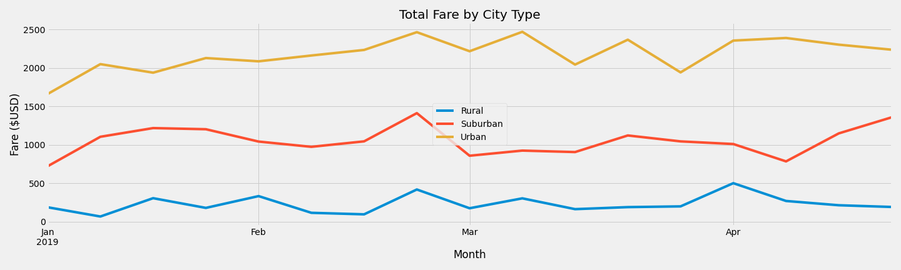

# PyBer Analysis 

## Overview of Project 
A data analyst, Omer, and the CEO, V.Isualize from PyBer, a Python based ride-sharing app company, has asked for assistance in creating visualizations of rideshare data to help improve access to ride-sharing services and determine affordability for underserved neighborhoods.

By utilizing data in the [city_data](Resources/city_data.csv) and the [ride_data](Resources/ride_data.csv) CSV files, an initial analysis was created which can be seen in [PyBer](PyBer.ipynb).

Specifically, the following were created in the initial analysis: 
* Bubble chart that showcases the average fare versus the total number of rides with bubble size based on the total number of drivers for each city type, including urban, suburban, and rural.
* The mean, median, and mode for the following:
    * The total number of rides for each city type.
    * The average fares for each city type.
    * The total number of drivers for each city type.
* Box-and-whisker plots that visualize each of the following to determine if there are any outliers:
    * The number of rides for each city type.
    * The fares for each city type.
    * The number of drivers for each city type.
* Pie chart that visualizes each of the following data for each city type:
    * The percent of total fares.
    * The percent of total rides.
    * The percent of total drivers.

Now V. Isualize has requested a summary DataFrame of the ride-sharing data by city type. Then, using Pandas and Matplotlib, V.Isualize would like a multiple-line graph that shows the total weekly fares for each city type. The ultimate objective is to see  how the data differs by city type and how those differences can be used by decision-makers at PyBer.

## Resources Used in the Analysis
- Data Source: [city_data](Resources/city_data.csv) and the [ride_data](Resources/ride_data.csv) 
- Software: Python 3.7, Jupyter Notebook
- Dependencies: Pandas, matplotlib

## Pyber Analysis Process 
Please see below a high-level overview of the secondary analysis. The updated PyBer Analysis can be seen in the [PyBer_Challenge](PyBer_Challenge.ipynb) file. Please see the file for details steps on how I achieved the below.

### Ride-sharing Summary DataFrame by City Type 
Using the Pandas `groupby()` function with the `count()` and `sum()` methods on PyBer DataFrame columns, I got the total number of rides, total number of drivers, and the total fares for each city type. Then, I calculated the average fare per ride and average fare per driver for each city type. Finally, I added this data to a new DataFrame, then formatted the columns.

### Multiple Line Chart of Total Fares for each city Type 
Utilizing two new functions in Pandas, `pivot()` and `resample()`, I created a multiple-line graph that shows the total fares for each week by city type.

## Results 
Please note that the images found below can also be found in the "analysis" folder. 

### Ride-sharing Summary DataFrame by City Type 
Please see below the ride-sharing summary dataframe by city type. 

From the dataframe, we can see the total rides, total drivers, total fares, average fare per ride and average fare per driver for each city type (rural, suburban and urban). 

#### Total Rides
It can be seen when looking at the Total Rides column, that Urban cities had the most rides, Suburban cities had the second most and Rural cities had the least. Urban cities had approximately 13 times more rides than rural cities. 

#### Total Drivers
Similarly, in the Total Drivers column, Urban cities had the most drivers, Suburban cities had the second most, and Rural cities had the least. Urban cities has about 30.8 times more drivers than rural cities. 

#### Total Fares
When looking at the Total Fares column, Urban cities had the most total fares for the period, suburban cities had the second most fares and rural cities had the least. Urban cities made about 9.2 times more dollars in total fares than rural cities. 

#### Average Fare per Ride 
When looking at the Average Fare per Ride column, Rural cities had the highest average fare per ride, suburban cities had the second highest and urban cities had the lowest average fare per ride. Rural cities average ride per share was about 1.4 times higher than urban cities. 

#### Average Fare per Driver 
In the Average Fare per Driver column, Rural cities had the highest average fare per driver, suburban cities had the second highest, and urban cities had the lowest average fare per driver. Rural cities average fare per driver was about 3.3 times higher than urban cities. 

#### Overall Observation 
From the above, it can be noted that while urban cities had the most rides, drivers and total fares, while rural cities had the least rides, drivers and total fares. Despite this, rural cities had the highest average fare per ride and average fare per driver. This is likely because, the supply of drivers does not meet the demand of rides. Therefore, the average fare per ridea nd average fare per driver is higher. Whereas, in Urban cities, there were actually more drivers than rides given during the period. The supply of drivers was a lot higher than the demand for rides. Therefore, the average fare per ride and average fare per driver were lower. 

Another consideration should be that in rural cities, there tends to be more distance between areas being driven too which could also increase the average fare per ride and average fare per driver. It could be assumed in the pricing structure, the longer the trip, the higher the fare. In contract, in urban cities, the trips may not be as far so that calls for smaller average fares per ride and average fares per driver. 

### Multiple Line Chart of Total Fares for each city Type 
Please see below the multiple line chart of total fares for each city type. 

The line chart is based on the following weekly fare dataframe. 

The line chart aboves shows the total fare by city type on a weekly basis over the period January 1, 2019 to April 28, 2019. The x-axis are the months, and the y-axis shows the total fare. As demonstrated in the legend, the yellow line represents total fares for urban cities, the red line represents the total fares for suburban cities and the blue line represents the total fares for rural cities. 

In line with the data frame analysis above, it can be noted right away that urban cities had the most total fares, suburban cities were in the middle, and rural cities had the least total fares. 

It can be observed that for all city types there was a peak in total fares towards the end of February. 

#### Urban Cities 
For urban cities, they had the lowest total fares in January (about $1,661.68 the week of January 6), however it steadily increases and hits the second highest total fares from the end of February ($2,466.29 the week of February 24) and then the highest total fare in the beginning of March ($2,470.93 the week of March 10). From mid-March to the end of April, the total fares remain with the range of $1,942.77 to $2,390.72. 

#### Suburban Cities 
For suburban cities, they had the lowest total fares in the beginning of January ($721.6 the week of January 6) and mid-April ($784.84 the week of April 14). The fares start rising after the beginning of January, maintaining within the $1042.50 - $1,218.20 range, and take a small dip in the beginning of February ($974.34 during the February 10 week). Total Fares start to rise again over the next couple of weeks and hit it's highest towards the end of February ($1,412.74 the week of February 24). Total fares then decrease and remain slightly below $1000, and pick back up again starting towards the end of March. Suburban cities finish fairly strong towards teh end of April, with the second highest fares being $1,357.75 the week of April 28.

#### Rural Cities 
For rural cities, they had the lowest total fares around mid-January ($67.65 the week of January 13). Fares sharply rise the following week to $306 for teh week of January 20. The total fares remain a bit volatile during teh following weeks, jumpint from total fares in the $100s to $300s every other week until hitting the second lowest total fare of $95.82 during the Feburary 17 week. Then total fares sharply rise to the second highest total fares of $419.06 the week of February 24. Following this week, total fares generally decrease to around the high $100s (with the exception of March 10th week, which had $303.94). Rural cities had the highest fare the first week of April (April 7 week) with $501.24 total fares. For the remaining weeks of April, total fares taper off into the $200s and eventally high $100s. 

## Summary 
In summary of the analysis above, the CEO of PyBer, V. Isualize, should consider finding the right balanced of demand & supply relating to number of rides and number of drivers to meet the specific needs of each city type. Additionally, V. Isualize should look at increasing total fares, and accordingly, the amount of rides in January, as all city types had the lowest amount of total fares during the first couple of weeks in January. A special area of focus should be rural cities, as they had the lowest amount of total fares and rides. 

To address the disparities by city types, below are some additional details on the suggestions:

* It is apparent that despite the high average fare per ride and average fare per driver, the total fares in Rural Cities is significantly lower than other city types. A suggestion would be to create more compelling compensation for drivers, or promote more marketing to hire drivers, so that the total driver count would increase. In the dataframe noted above, the total rides was almost double the amount of drivers for the period. Having more drivers would help meet the demand in rural cities. This may lower the average fare per ride or the average fare per driver, but may increase total fares overall. A few things to note: 
    * Drives may be longer in rural cities. Perhaps providing a better mileage or gas incentives will help increase the amount of drivers. Additionally, the longer time it takes to drop someone off should be considered. 

    * Rural cities tend to be less populated, are the ride rates reflecting the actual demand in these areas? 

* Another suggestion is to perhaps market PyBer more to customers in urban cities. In the dataframe, it shows that there are about 1.5 times more drivers than rides. Perhaps a good strategy is to drive the need for PyBer, even if it is a short trip. By driving more demand for rides, this can also help increase the average fare per ride and the average fare per driver. 

* Additionally, PyBer may want to consider capping the amount of drivers in Urban cities, depending on the current demand for rides. This can also help increase the average fare per ride and the average fare per driver. 

* While suburban cities remains in the middle, from the dataframe it can be observed that there are still more rides than drivers. A suggestion could be to increase the number of rides and also increase the number of drivers accordingly to bring the total fares higher.

* Another suggestion is to try and get more rides in January. For all cities, January had the lowest total fares. Perhaps by lowering the ride fare since the demand for rides is likely low. 

* For rural cities, more stability is needed in the total rates across January - April (minimum of $67.65 and peak of $501.24). 
